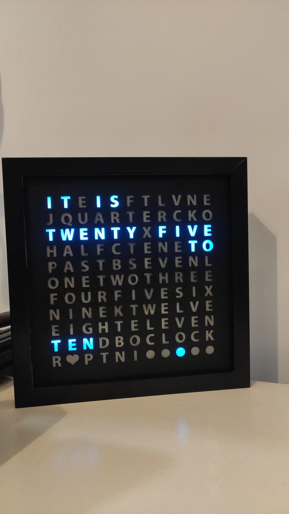
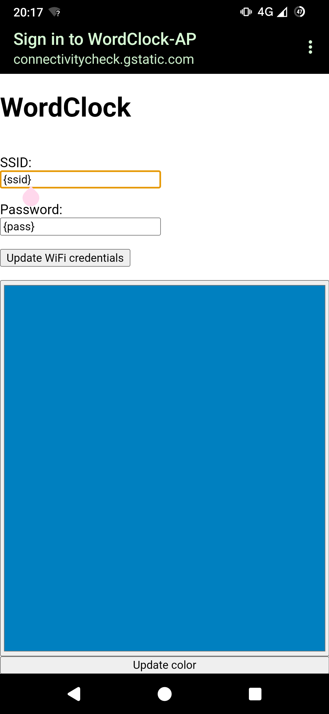

<!---
Copyright (C) 2023 Emre Simsirli
-->

# wordclock-esp32

ESP32-Arduino version of [WordClock](https://github.com/emrsmsrli/WordClock/).

## Features

- Smooth async animation 
- Time update from SNTP every boot
- Low brightness LEDs at night
- WiFi AP point for customization
- WiFi STA connection for time synchronization
- Async execution with RTOS tasks
- Alarm system for arbitrary functionality

## WiFi access point web interface

This project also incorporates a web interface where one can 
configure the credentials WiFi STA connection. This is achieved
by setting ESP32 WiFi as a DNS captive portal.

## Building

### Software

1. Install [PlatformIO](https://platformio.org/) for VSCode or CLion
2. Change AP password to whatever you want in `platformio.ini`
3. Build using the IDE

### Hardware

Actual build instructions for the hardware are 
in [Tinker's WordClock page](https://www.instructables.com/Tinkers-Word-Clock-REVISITED-NOW-110-More-AWESOME-/) 

For this project though, you only need an ESP32 devkit (or your custom build). 
Then you should plug the LED array into pin 13 (GPIO12), connect the power lines, and you're all set! 
As per [AdaFruit best practices](https://learn.adafruit.com/adafruit-neopixel-uberguide/best-practices), should also put a capacitor and a resistor 
in the appropriate places on the circuit.

## Setting up

When you first flash this program, WordClock won't be able to update the time from SNTP.
You should connect to the AP (**SSID:** _WordClock-AP_) and set the credentials there.

## Licence

This code is licenced under MIT, which can be found in the `LICENCE` file
